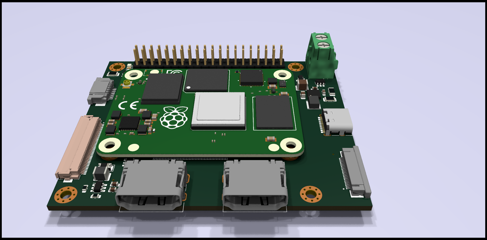
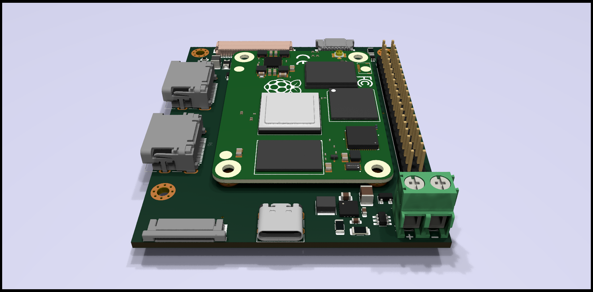
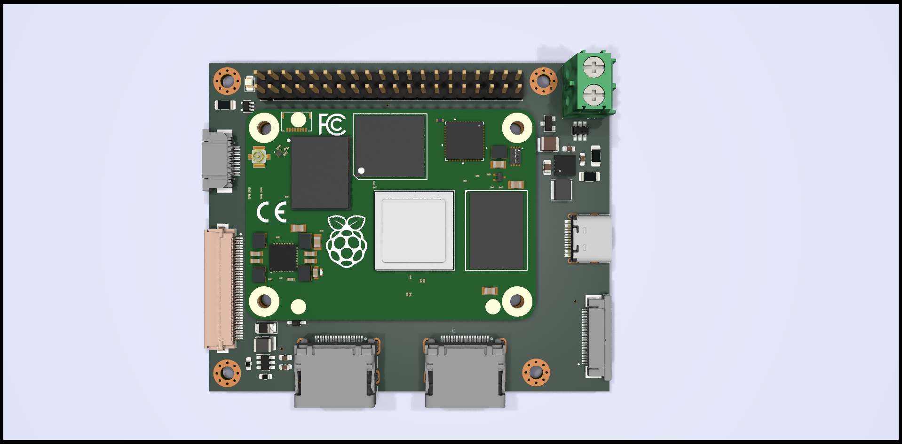

# RCM4DEV
A Raspberry Pi CM4 Dev Board with HDMI outputs, 4 lane MIPI DSI output for 10.1 inch LCD panel with CTP touch, 4 lane MIPI CSI for camera and USB type-C.
Terminal Block for power in 6 - 17V DC.

